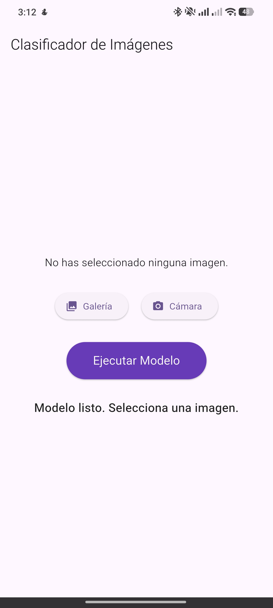
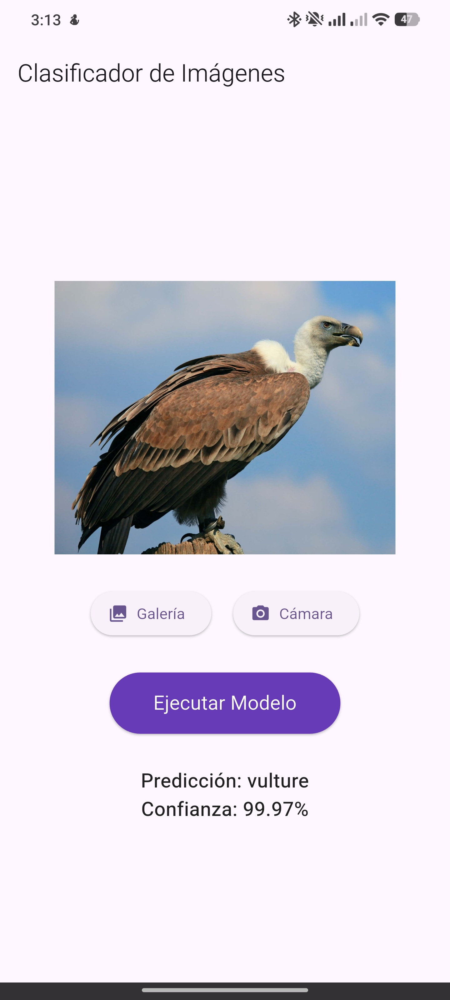
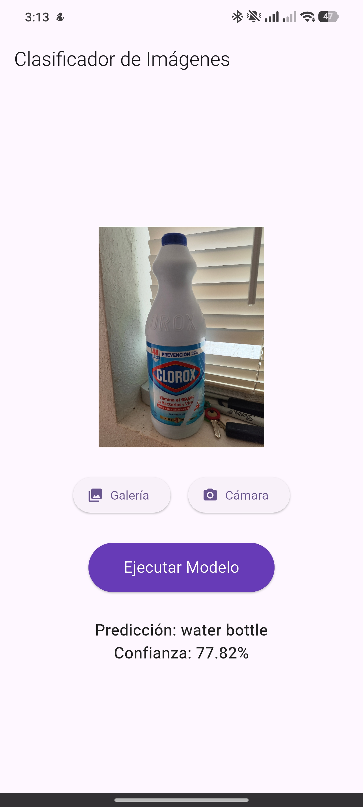

# Clasificador TFLite (tf_app)

Un proyecto en Flutter que implementa un clasificador de imágenes utilizando TensorFlow Lite.

## Descripción

Esta aplicación permite a los usuarios seleccionar una imagen, ya sea desde la galería o tomando una foto con la cámara del dispositivo, y utiliza un modelo de machine learning (MobileNet v1) pre-entrenado para clasificar la imagen e identificar su contenido. La aplicación procesa la imagen e infiere el resultado localmente, mostrando la predicción más probable junto con su porcentaje de confianza.

## Características

* **Clasificación en dispositivo**: Utiliza `tflite_flutter` para correr el modelo de IA de forma local y rápida.
* **Captura de imágenes**: Integración con la cámara nativa del dispositivo y la galería a través del paquete `image_picker`.
* **Procesamiento de imágenes**: Ajuste de imágenes a través de la librería `image` (redimensionamiento a 224x224 píxeles para coincidir con la arquitectura de MobileNet).
* **Diseño moderno**: Interfaz de usuario intuitiva construida utilizando Material Design 3.

## Capturas de Pantalla

A continuación, se muestran algunas vistas de la aplicación en funcionamiento:

<div style="display:flex; justify-content:space-around;">
  <div style="text-align: center;">
    <h3>Pantalla Principal</h3>
    
  </div>
  <div style="text-align: center;">
    <h3>Resultado de Galería</h3>
    
  </div>
  <div style="text-align: center;">
    <h3>Resultado de Cámara</h3>
    
  </div>
</div>

## Tecnologías y Dependencias Principales

El proyecto usa las siguientes versiones de SDK y paquetes:

* Flutter SDK `^3.10.7`
* `tflite_flutter` (`^0.12.1`): Ejecución de inferencias con TFLite.
* `image_picker` (`^1.2.1`): Obtención de fotos e imágenes desde el repositorio del SO.
* `image` (`^4.7.2`): Manejo de mapas de bits, formateo y escala pre-inferencia.
* `logger` (`^2.6.2`): Impresión de logs de debug limpios en terminal.

## Modelos utilizados

> [!IMPORTANT]
> **Nota sobre los modelos**: Para evitar subir archivos binarios pesados al repositorio git, los modelos de TensorFlow Lite están agregados al archivo `.gitignore`. 

Quien clone este proyecto deberá obtener estos archivos descargándolos o generándolos manualmente, y colocarlos dentro de la carpeta `assets/models/` antes de ejecutar la aplicación:

1. `mobilenet_v1_1.0_224.tflite` (Modelo de clasificación MobileNet).
2. `labels.txt` (Listado de clases o categorías que reconoce el modelo).

Asegúrate de que la estructura luzca de esta manera antes de compilar:
```text
assets/
 └── models/
     ├── labels.txt
     └── mobilenet_v1_1.0_224.tflite
```

## Instalación y Ejecución

1. Clona este proyecto localmente.
2. Descarga todas las dependencias:
   ```bash
   flutter pub get
   ```
3. Ejecuta la aplicación en un dispositivo físico o emulador (se recomienda un dispositivo real para probar la cámara):
   ```bash
   flutter run
   ```
